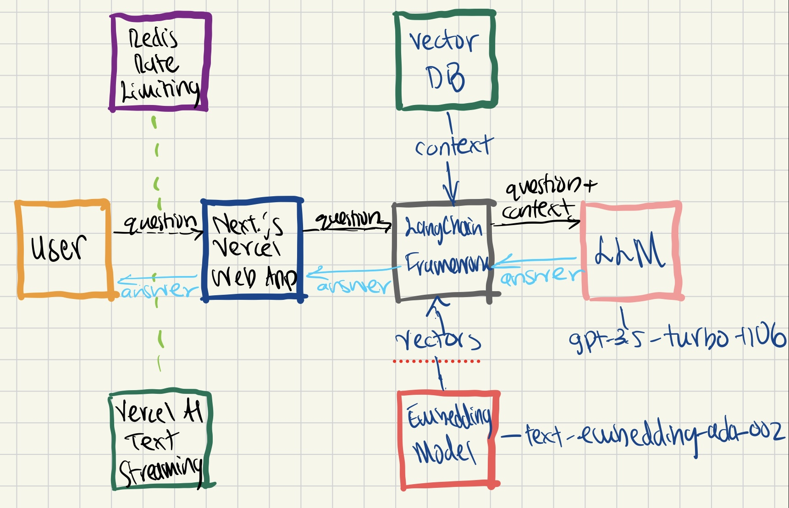
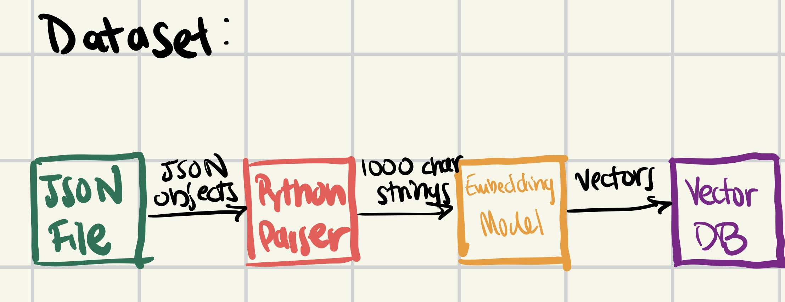
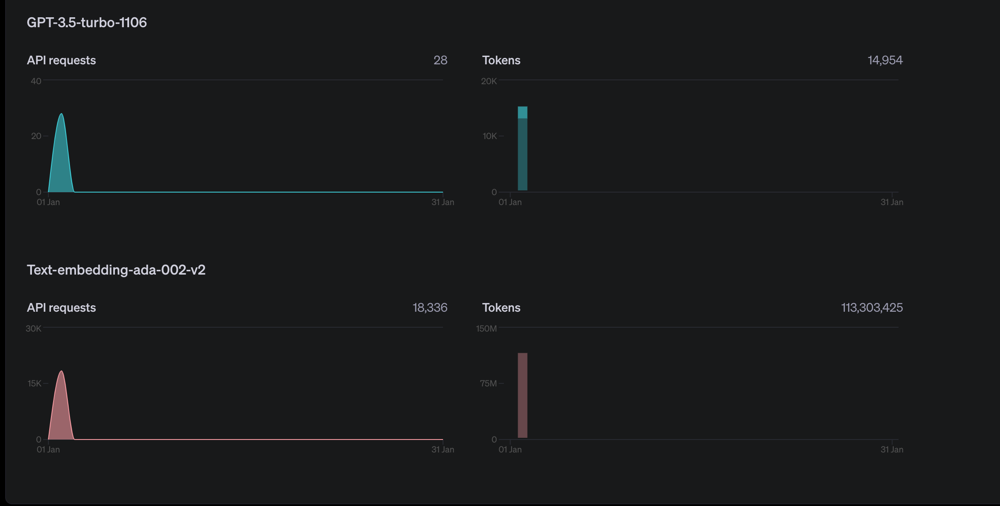

# Physics Scientific Literature RAG Chatbot

Try out the application here!: https://physicsragchatbot.vercel.app/

This RAG (Retrieval Augmented Generation) Chatbot specializes in the summaries of a large dataset of Physics Scientific Literature pulled from arxiv.org. The web chatbot can answer questions covering the following information from the papers: title, abstract, author(s), publication date, and other more specific details. The RAG app works by vectorizing the user text input and using a Euclidean similarity comparison to find relevant pieces of data in the Vector DB. The user input and the relevant context pulled from the DB are then combined and fed into the LLM to provide a response to the user.

Some features:

- 560,300 Physics Paper vectorized dataset available for context (with the option to increase to 1.7 million by upgrading the Vector DB)
- Multi-thread JSON data parsing and vectorizing
- Fast answers using real-time text streaming from Vercel AI

This chatbot is trained on data from arxiv.org as an example, but is totally domain agnostic. This project can be modified to run on any dataset either by modifying the built-in crawler or by uploading an alternative JSON dataset and then updating the LLM query template in route.tsx

## Overview

1. [Stack](#stack)
2. [Setup](#setup)
   1. [Data Parser](#step-1-data-parser)
   2. [Front-end Chatbot](#step-2-chatbot)
3. [Future Changes](#future-changes)
4. [Sample Q&A](#sample-qa)

## Stack

- LLM Orchestration: [Langchain.js](https://js.langchain.com)
- Text Streaming & Deployment: [Vercel AI](https://vercel.com/ai)
- Embedding Model: [OpenAI](https://openai.com/), [text-embedding-ada-002](https://platform.openai.com/docs/guides/embeddings)
- Generative Model: [OpenAI](https://openai.com/), [gpt-3.5-turbo-1106](https://platform.openai.com/docs/models)
- Web Chatbot: [Next.js](https://nextjs.org/)
- Data Parsing: Python
- Vector DB: [Upstash](https://upstash.com/)
- Rate Limiting: [Upstash](https://upstash.com/)
- Crawler (not used in final product): [scrapy](https://scrapy.org/)

### Tech Stack Overview & Interactions:



## Setup

For local development, you can clone this repository by running the following:

```
git clone https://github.com/rahulsinghh4/RAG.git
```

This project contains two primary components: the data parser and the chatbot.

## Step 1: Data Parser

### Overview

My first attempt to pull data was using a web crawler based on scrapy. Scrapy was chosen due to my familiarity in Python, and scrapy is the most used crawler. After running the crawler on a trial test with a depth limit of 10 sites, the data that was vectorized was almost entirely unusable, as very little relevant information was actually gathered. In theory the scraper could have been customized to only pull the paper abstract data, but this customization would likely have taken significantly more time due to the difficulty of parsing HTML.

Another issue with using the crawler was that the arxiv.org website has a robots.txt file that limits scrapes to occur only in 15 second intervals. Collecting the data on the scale which was eventually used would have taken roughly 295 days at this rate. An alternative was to use the arxiv API to load the papers‘ abstract data, but this API also had a rate limiter that limited requests to occur at max every 3 seconds. This would result in a roughly two month turnaround for collecting the data

After this research, I ended up scrapping the crawler program and instead found a dataset from Kaggle sourced directly from ArXiv that provided roughly 1.7 million JSON objects that included all the relevant details about each paper. This dataset is updated roughly every week, so one drawback is that it won’t contain the latest Physics papers published.

This dataset was then downloaded and parsed in Python to convert the JSON objects into strings of length 1000 with a 100 character overlap in between strings. I chose Python due to the ease of development and the large libraries of code available for parsing JSON.

The data from the JSON objects in string form was then fed into OpenAI‘s embedding model text-embedding-ada-002, which provided a vectorized form of the data to use for similarity comparisons with the user input later. This specific model was chosen for embeddings, because it has a dimensionality of 1536 for its vector outputs, which corresponds to the limit on Upstash for its vector DB. Open AI‘s models are also very well-documented with plenty of examples to reference if any issues arise.

Finally, the text and vector data combined was uploaded to a vector database on Upstash, with a total of 900 thousand vectors stored, corresponding to approximately 560,000 papers.

I used Upstash for the vector database due to the simplicity of their APIs and the fact that they offer in-built vector similarity search operations that allow for easy search for relevant embeddings. One drawback of Upstash is the relatively limited docs available for errors and debugging — some of their old features (such as using an external embedding model like I did) are deprecated and it’s hard to find any documentation for the error codes. This resulted in a higher debugging time. Ultimately, their discord support channel contained an old thread that mentioned a workaround to the problem I was experiencing with their API.

In order to address rate limits with OpenAI‘s embedding model, a token counting estimation was added, along with an exponential backoff when hitting rate limits. The asyncio and ThreadPoolExecutor libraries in Python were also utilized to allow for asynchronous and parallel processing, due to the dataset being over 4 GB on size.

Batching was also used to optimize the vector upserts, so that the program was not dependent on the entire dataset being parsed, vectorized, and uploaded. This allowed for a partial dataset to be able to be used in the end due to various API limits.

Parsing, vectorizing, and uploading the data took the program roughly 16 hours (running in the background).

The OpenAI API key and the Upstash Vector DB URL and Token were stored in the Python venv activate file as environment variables for security.

### Data Parsing Diagram



### Configure Environment Variables

Before you can run the data parser, you need to configure environment variables. The environment variabels allow you to securely store sensitive information, such as the API keys and tokens.

You can create an Upstash Vector DB [here](https://console.upstash.com/vector) and set 1536 as the vector dimensions and Euclidean as the similarity function. We set 1536 here because that is the amount needed by the embedding model we will use.

The following environment variables should be set:

```
# Upstash Vector credentials retrieved here: https://console.upstash.com/vector
UPSTASH_VECTOR_REST_URL=****
UPSTASH_VECTOR_REST_TOKEN=****

# OpenAI key retrieved here: https://platform.openai.com/api-keys
OPENAI_API_KEY=****
```

### Install Required Python Libraries

To install the libraries, I suggest setting up a virtual Python environment. Before starting the installation, navigate to the `physragcrawler` directory.

To setup a virtual environment, first install `virtualenv` package:

```bash
pip install virtualenv
```

Then, create a new virtual environment and activate it:

```bash
# create environment
python3 -m venv venv

# activate environment
source venv/bin/activate
```

Finally, use the `requirements.txt` file to install the required libraries:

```bash
pip install -r requirements.txt
```

</br>

Configure the environment variables in the venv/bin/activate file by adding the following under "export path":

```
export UPSTASH_VECTOR_REST_URL="your_vector_rest_url"
export UPSTASH_VECTOR_REST_TOKEN="your_vector_rest_token"
export OPENAI_API_KEY="your_open_ai_api_key"
```

### Download dataset

Download the data from `https://www.kaggle.com/datasets/Cornell-University/arxiv/data` and add it to the physragcrawler/physragcrawler/utils directory.

To run the data parser (and vectorizer), run the following command from the physragcrawler/physragcrawler/utils directory:

```bash
python3 parse_and_upload.py
```

#### Sample Program output


#### Sample API Usage Stats



## Step 2: Chatbot

### Overview

The chatbot was created using Next.js based on another open-source model. I chose Next.js due to prior experience with the framework when building my own website and due to the relevancy of the framework for modern web apps. I also already had the necessary libraries installed on my computer. The key features involved here were text streaming and rate limiting. Text streaming was achieved using Vercel AI in order for the user to see partial responses appear before they completed. This enhances user experience by allowing the user to start reading the response almost instantly. I used the LangChain framework for the LLM orchestration, as it comes pre-built with many of the features I was looking to use in my RAG app, such as the OpenAI API, the Vector DB, and native RAG workflows for context-retrieval. The LLM powering the front-end is gpt-3.5-turbo-1106. This was used as it was the model linked to an older LangChain project I used as a template, but in retrospect I would instead use gpt-4o-mini, as it has a larger context window (128,000 tokens) and a larger output token size (16,384). Changing the model is as simple as respecifying the model when calling the OpenAI() function.

The app was then hosted on Vercel, which was chosen for quick deployment and is a standard for RAG apps when I was researching for the project.

### Environment Variables

Before we can run the chatbot locally, we need to set the environment variables in the `.env.local` file.

Your `.env.local` file should look like this:

```
# Redis tokens retrieved here: https://console.upstash.com/
UPSTASH_REDIS_REST_URL=
UPSTASH_REDIS_REST_TOKEN=

# Vector database tokens retrieved here: https://console.upstash.com/vector
UPSTASH_VECTOR_REST_URL=
UPSTASH_VECTOR_REST_TOKEN=

# OpenAI key retrieved here: https://platform.openai.com/api-keys
OPENAI_API_KEY=
OPENAI_ORGANIZATION=
```

The `UPSTASH_REDIS_REST_URL` and `UPSTASH_REDIS_REST_TOKEN` are needed for rate-limiting based on IP address. In order to get these env vars, go to the Upstash dashboard and create a Redis database.

Finally, set the `OPENAI_API_KEY` and `OPENAI_ORGANIZATION` environment variables you can get [here](https://platform.openai.com/api-keys) which allows us to vectorize user queries and generate responses.

### Running the Program

Set up all neccessary environment variables and run `npm install` to install all local packages needed to run the app, you can start the chatbot using the command:

```bash
npm run dev
```

Visit `http://localhost:3000` to see the chatbot live.

To customize the chatbot further, you can update the AGENT_SYSTEM_TEMPLATE in the route.tsx file to match a different use case.

</br>

### Deployment

Visit `vercel.com` and follow the steps there to deploy a production version of the webapp!

## Debugging:

Most of my debugging was related to parsing the JSON file I used for the data, but after some assistance from google searches and Claude (Anthropic), I was able to successfully parse the data after about 30 minutes of trial and error.

Other debugging issues I had were related to missing imports due to having multiple versions of Python and Pip installed locally. Specifying the Python and pip versions when installing the packages solved this issue. The Python virtual environment also helped to organize the package installs to be local to the project.

## Future Changes

Future modifications (with more time):

- use an open source free embedding model to limit cost
- Expand input data to include the entire paper instead of just the paper abstract, title, author, and publication information
- Generalizing the RAG to work on any website dataset by configuring the crawler better
- Update the links to provide access to the actual pdfs instead of just a link to the dataset (the dataset unfortunately did not include links to the source materials)

# Sample Q&A

<details>

## Sample Questions and Responses:

#### What are some of the recent papers published from research at the Large Hadron Collider (LHC)?

Here are the top 3 closest matches to recent papers published from research at the Large Hadron Collider (LHC):

1. Title: Electroweak Physics at LHC
   - Abstract: The Large Hadron Collider, LHC, though meant for discovery, will provide enough data from early phase to also perform various studies of Standard Model processes in as yet unexplored kinematic regions. Precision measurements of the electroweak variables will be possible due to the large rates of W and Z boson productions combined with clean leptonic signatures. Examples of simulation results from CMS and ATLAS collaboration studies are presented to show the wide variety of measurements possible and how various issues like background estimation, determination of systematic effects will be taken care of by the experiments.
2. Title: Collisions at the Large Hadron Collider with the CMS detector
   - Abstract: This paper presents measurements and studies of top-quark properties and gives prospects for future measurements at the Large Hadron Collider (LHC).
3. Title: The LHC and recent experimental results from the B factories and the Tevatron \* Abstract: This paper discusses the impact on the LHC left by the recent experimental results from the B factories and the Tevatron.
   I hope you find these recent papers from LHC research insightful.

#### What is a research paper title and abstract for new research on Lie groups from arxiv.org?

Here is a research paper title and abstract for new research on Lie groups from arxiv.org:
Title: Groupoïdes de Lie et Feuilletages Abstract: This is a survey concerning the relationship between Lie Groupoids (and their morphisms) and singular foliations in the sense of Sussmann-Stefan (considered from a purely geometrical point of view). We focus on the interaction between the algebraic and differentiable structures underlying Lie groupoids, and between groups and graphs of equivalence relations, regarded as two basic degeneracies for groupoids. Historical remarks, motivations and examples are developed in five appendices.
I hope you find this research paper on Lie groups insightful and relevant to your inquiry.

#### Can you provide a summary of new research on the discrete dipole approximation?

Here are the top 3 closest matches to your query on the discrete dipole approximation:

1. Title: Convergence of the discrete dipole approximation. II. An extrapolation technique to increase the accuracy
   - Abstract: The paper proposes an extrapolation technique to improve the accuracy of discrete dipole approximation computations. The technique was studied empirically and demonstrated extraordinary performance, especially for cubically shaped particles.
2. Title: User Guide for the Discrete Dipole Approximation Code DDSCAT 7.2
   - Abstract: This paper provides a user guide for the discrete dipole approximation code DDSCAT 7.2, which is a freely available open-source software package for calculating scattering and absorption of electromagnetic waves by targets with arbitrary geometries and complex refractive index.
3. Title: Dynamics of two-dimensional dipole systems \* Abstract: This paper studies the current fluctuation spectra and collective mode dispersions of the classical two-dimensional dipole system, which is characterized by a repulsive interaction potential. The system is of interest due to its unique collective mode behavior and its potential as a model for closely spaced semiconductor electron-hole bilayers.
   I hope you find these research papers helpful for your inquiry.

#### What are some new insights in the search for neutrinoless double beta decay?

Here are some recent insights in the search for neutrinoless double beta decay:

1. Title: Searches for neutrinoless double beta decay Abstract: Neutrinoless double beta decay is a lepton number violating process whose observation would also establish that neutrinos are their own anti-particles. There are many experimental efforts with a variety of techniques. Some experiments, such as EXO, Kamland-Zen, GERDA phase I, and CANDLES, have reported measurements and sensitivities for the double beta decay process.
2. Title: A realistic model of neutrino masses with a large neutrinoless double beta decay rate Abstract: This paper discusses a minimal Standard Model extension with the Weinberg operator that accommodates observed neutrino masses and mixing. It provides a realization of a scenario with potential LHC effects and calculable neutrino masses, as well as a large neutrinoless double beta decay rate.
3. Title: Probing the Majorana nature of the neutrino with neutrinoless double beta decay Abstract: Neutrinoless double beta decay (NDBD) is the only experiment that could probe the Majorana nature of the neutrino. This paper studies the theoretical implications of NDBD for models yielding tri-bimaximal lepton mixing like A4 and S4.
   I hope you find these recent insights on neutrinoless double beta decay informative and relevant to your inquiry.

#### What are some new research papers related to Brownian motion?

Here are some recent research papers related to Brownian motion:

1. Title: Brownian motion at short time scales Abstract: Brownian motion has played important roles in many different fields of science since its origin was first explained by Albert Einstein in 1905. Recent experimental developments in optical trapping and detection have made the new regime of Brownian motion accessible. This review summarizes related theories and recent experiments on Brownian motion at short time scales, with a focus on the measurement of the instantaneous velocity of a Brownian particle in a gas and the observation of the transition from ballistic to diffusive Brownian motion in a liquid.
2. Title: Active Brownian motion of an asymmetric rigid particle Abstract: This paper quantifies the individual movements of a rod-like self-propelled particle on a flat substrate and studies the Brownian motion of an asymmetric rod-like rigid particle self-propelled at a fixed speed along its long axis in two dimensions. The theoretical model presented here is anticipated to better describe individual cell motion as well as intracellular transport in 2D than previous models.
3. Title: Brownian Motion of Graphene Abstract: This study focuses on the Brownian motion of optically trapped graphene flakes, which orient orthogonal to the light polarization due to the optical constants anisotropy. The understanding of two-dimensional Brownian motion paves the way to light-controlled manipulation and all-optical sorting of biological membranes and anisotropic macromolecules.
   I hope you find these recent research papers related to Brownian motion informative and relevant to your inquiry.

#### Can you summarize new research findings about dark matter annihilation in the Draco constellation?

Here are some recent research findings related to dark matter annihilation in the Draco constellation:

1. Title: Dark Matter annihilation in Draco: new considerations on the expected gamma flux Abstract: A new estimation of the gamma-ray flux that we expect to detect from SUSY dark matter annihilation from the Draco dSph is presented using the DM density profiles compatible with the latest observations. This calculation takes also into account the important effect of the Point Spread Function (PSF) of the telescope. We show that this effect is crucial in the way we will observe and interpret a possible signal detection. Finally, we discuss the prospects to detect a possible gamma signal from Draco for MAGIC and GLAST.
2. Title: Search for Dark Matter Annihilation in Draco with STACEE Abstract: For some time, the Draco dwarf spheroidal galaxy has garnered interest as a possible source for the indirect detection of dark matter. Its large mass-to-light ratio and relative proximity to the Earth provide favorable conditions for the production of detectable gamma rays from dark matter self-annihilation in its core. The Solar Tower Atmospheric Cherenkov Effect Experiment (STACEE) is an air-shower Cherenkov telescope located in Albuquerque, NM capable of detecting gamma rays at energies above 100 GeV. We present the results of the STACEE observations of Draco during the 2005-2006 observing season totaling 10 hours of livetime after cuts.
3. Title: Dark matter searches with Cherenkov telescopes: nearby dwarf galaxies or local galaxy clusters? Abstract: In this paper, we compare dwarf galaxies and galaxy clusters in order to elucidate which object class is the best target for gamma-ray DM searches with imaging atmospheric Cherenkov telescopes (IACTs). We have built a mixed dwarfs+clusters sample containing some of the most promising nearby dwarf galaxies (Draco, Ursa Minor, Wilman 1 and Segue 1) and local galaxy clusters (Perseus, Coma, Ophiuchus, Virgo, Fornax, NGC5813 and NGC5846), and then compute their DM annihilation flux profiles by making use of the latest modeling of their DM density profiles.
   I hope you find these recent research findings on dark matter annihilation in the Draco constellation informative and relevant to your inquiry.

#### What are some new findings in the subfield of nuclear reactions at relativistic energies?

Here are some recent findings in the subfield of nuclear reactions at relativistic energies:

1. Effects of relativistic kinematics in heavy ion elastic scattering
   - This paper discusses relativistic corrections to the reaction kinematic parameters for elastic scattering of various heavy ions from different targets at incident energies between 20 and 100 MeV/nucleon. Read more
2. Production of hypernuclei in peripheral relativistic ion collisions
   - This study explores the production of hypernuclei in relativistic ion collisions, demonstrating an increase in yields of hypernuclei above the energy threshold for Lambda hyperons. The paper also discusses the possibilities for the detection of such hypernuclei with planned and available relativistic ion facilities. Read more
3. High-energy neutrinos from reverse shocks in choked and successful relativistic jets \* This paper revisits the early evolution of a relativistic jet inside a star and investigates its neutrino emission, particularly focusing on the propagation of mildly relativistic and ultrarelativistic jets through a type Ib progenitor and the production of high-energy neutrinos. Read more
   I hope you find these findings insightful and relevant to your interests in nuclear reactions at relativistic energies.

#### Can you provide three paper abstracts related to the quantum Hall effect?

Here are three paper abstracts related to the quantum Hall effect:

1. Title: "Observation of the Fractional Quantum Hall Effect in Graphene" Abstract: When electrons are confined in two dimensions and subjected to strong magnetic fields, the Coulomb interactions between them become dominant and can lead to novel states of matter such as fractional quantum Hall liquids. In these liquids, electrons linked to magnetic flux quanta form complex composite quasiparticles, which are manifested in the quantization of the Hall conductivity as rational fractions of the conductance quantum. The recent experimental discovery of an anomalous integer quantum Hall effect in graphene has opened up a new avenue in the study of correlated 2D electronic systems, in which the interacting electron wavefunctions are those of massless chiral fermions. However, due to the prevailing disorder, graphene has thus far exhibited only weak signatures of correlated electron phenomena, despite concerted experimental efforts and intense theoretical interest. Here, we report the full abstract here.
2. Title: "Quantum Hall effect in a one-dimensional dynamical system" Abstract: We construct a periodically time-dependent Hamiltonian with a phase transition in the quantum Hall universality class. One spatial dimension can be eliminated by introducing a second incommensurate driving frequency, so that we can study the quantum Hall effect in a one-dimensional (1D) system. This reduction to 1D is very efficient computationally and would make it possible to perform experiments on the 2D quantum Hall effect using cold atoms in a 1D optical lattice. Full abstract here.
3. Title: "Quantum Hall Effect in Quantum Electrodynamics" Abstract: We consider the quantum Hall effect in quantum electrodynamics and find a deviation from the quantum mechanical prediction for the Hall conductivity due to radiative antiscreening of electric charge in an external magnetic field. A weak universal dependence of the von Klitzing constant on the magnetic field strength, which can possibly be observed in a dedicated experiment, is predicted. Full abstract here.
   I hope you find these abstracts helpful for your research. If you need more information, feel free to ask!

#### What are the latest papers published in quantum mechanics?

Here are some of the latest papers published in quantum mechanics:

1. Title: "Principles and Dynamics of Quantum Mechanics" Abstract: The fundamental principle of quantum mechanics is that the probabilities of physical outcomes are obtained from the intermediate states and processes of the interacting particles, considered as happening concurrently. When the interaction is described by a potential, the total energy of the particle is equal to its total kinetic plus potential energies. The authors derive the Schrodinger and Dirac equations as the conditions the wavefunction must satisfy at each point in order to fulfill the corresponding energy equation. In their approach, quantum theory is tangible, experimentally justified, and theoretically consistent. Link to Paper
2. Title: "Quantum Nanomechanics" Abstract: Quantum Nanomechanics is the emerging field which pertains to the mechanical behavior of nanoscale systems in the quantum domain. Unlike the conventional studies of vibration of molecules and phonons in solids, quantum nanomechanics is defined as the quantum behavior of the entire mechanical structure, including all of its constituents--the atoms, the molecules, the ions, the electrons as well as other excitations. The relevant degrees of freedom of the system are described by macroscopic variables and quantum mechanics in these variables is the essential aspect of quantum nanomechanics. In spite of its obvious importance, however, quantum nanomechanics still awaits proper and complete physical realization. The authors provide a conceptual framework for defining quantum nanomechanical systems and their characteristic behaviors, and chart out possible avenues for the experimental realization of bona fide quantum nanomechanical systems. Link to Paper
3. Title: "Quantum mechanics and finite propagation speed" Abstract: This paper discusses the mathematical behavior of Schrödinger equation solutions in the context of quantum mechanics. The authors introduce a hypothesis that in reality, the speed of propagation of the perturbed sub-region borders is equal to the speed of light. Based on this hypothesis, they develop and analyze a finite propagation speed concept for non-relativistic quantum equations, leading to a local interpretation of non-relativistic quantum mechanics consistent with the principle of locality and free of local hidden variables. The theory is applied to the analysis of the Einstein-Podolsky-Rosen (EPR) paradox, entanglement, and properties of perturbed matter waves. The authors prove that the formulated theory agrees with results of classical experiments on electron matter waves diffraction. Link to Paper
   I hope you find these papers helpful for your research. If you need more information, feel free to ask!

#### Who are the leading authors contributing to research on condensed matter physics?

The leading authors contributing to research on condensed matter physics include:

1. A. Avgoustidis and Joaquim Gomis - Link to Paper
2. Alex Hayat, Parisa Zareapour, Shu Yang F. Zhao, Achint Jain, Igor G. Savelyev, Marina Blumin, Zhijun Xu, Alina Yang, G. D. Gu, Harry E. Ruda, Shuang Jia, R. J. Cava, Aephraim M. Steinberg, and Kenneth S. Burch - Link to Paper
3. R. Naren, Tamizhavel Arumugam, and S. Ramakrishan - Link to Paper
   These authors have made significant contributions to the field of condensed matter physics. If you need more information, feel free to ask!

#### Can you provide the abstract of the paper titled "Exploring Quantum Entanglement in Spin Chains"?

The abstract of the paper titled "Creation and manipulation of entanglement in spin chains far from equilibrium" explores the investigation of creation, manipulation, and steering of entanglement in spin chains from the viewpoint of quantum communication between distant parties. The paper demonstrates how global parametric driving of the spin-spin coupling and/or local time-dependent Zeeman fields produce a large amount of entanglement between the first and the last spin of the chain. This occurs whenever the driving frequency meets a resonance condition, identified as "entanglement resonance". The approach marks a promising step towards an efficient quantum state transfer or teleportation in solid-state systems. Additionally, the paper proposes the generation and routing of multipartite entangled states by using symmetric tree-like structures of spin chains and studies the effect of decoherence on the resulting spin entanglement between the corresponding terminal spins.
You can access the full paper here.
If you need more information, feel free to ask!

#### What are the most recent papers in astrophysics according to the dataset?

Here are some of the most recent papers in astrophysics:

1. Title: "The Physics of Neutron Stars: From Central Engines to the ISM" Authors: N. Rea, G. L. Israel, J. A. Pons, R. Turolla, D. Vigano, S. Zane, P. Esposito, R. Perna, A. Papitto, G. Terreran, A. Tiengo, D. Salvetti, J. M. Girart, Aina Palau, A. Possenti, M. Burgay, E. Gogus, A. Caliandro, C. Kouveliotou, D. Gotz, R. P. Mignani, E. Ratti, L. Stella Comments: ApJ in press (15 pages, 11 figures) Link to Paper
2. Title: "Nuclear Physics and Astrophysics Applications of the Symmetry Energy" Authors: Martin Veselsky, Yu-Gang Ma Comments: 20 pages, 9 figures, to appear in Physical Review C Link to Paper
3. Title: "Laboratory Astrophysics: From the Cosmos to the Laboratory" Authors: D. W. Savin, N. S. Brickhouse, J. J. Cowan, R. P. Drake, S. R. Federman, G. J. Ferland, A. Frank, M. S. Gudipati, W. C. Haxton, E. Herbst, S. Profumo, F. Salama, L. M. Ziurys, and E. G. Zweibel Comments: 61 pages. 11 figures; to appear in Reports on Progress in Physics Link to Paper
   I hope you find these papers helpful for your research. If you need more information, feel free to ask!

#### What recent advancements have been made in high-temperature superconductors?

Recent advancements in high-temperature superconductors include:

1. Title: "Design of new superconducting materials, and point contact spectroscopy as a probe of strong electron correlations" Abstract: The recent discovery of a new class of high-temperature superconductors has made the community more enthusiastic than ever about finding new superconductors. Researchers in the field have grown into an enthusiastic global network to predictively design new superconductors. This paper shares guidelines for searching for high-temperature superconductors and discusses the design of new superconducting materials. Link to Paper
2. Title: "Mechanisms of high-temperature superconductivity in cuprates and Fe-based superconductors" Abstract: This paper provides an overview of the mechanisms crucial for power and magnet applications in high-temperature superconductors, particularly for the yet-to-be-discovered superconductors operating at room temperatures. It discusses the materials restrictions that need to be satisfied in order to make superconductors useful at high temperatures and magnetic fields. Link to Paper
3. Title: "Enhancement of bulk superconducting transition temperatures" Abstract: An enhancement of bulk superconducting transition temperatures of up to 20% was found to occur upon high-temperature annealing of samples. This advancement holds promise for improving the performance of high-temperature superconductors. Link to Paper
   These advancements reflect the ongoing efforts to understand, design, and optimize high-temperature superconductors. If you need more information, feel free to ask!

#### Are there any papers on the application of machine learning in quantum computing?

Here are some papers on the application of machine learning in quantum computing:

1. Title: "Quantum Learning Machine" Abstract: The paper proposes a novel notion of a quantum learning machine for automatically controlling quantum coherence and for developing quantum algorithms. It demonstrates that the quantum learning machine learns Deutsch's task and finds itself a quantum algorithm, which is different from but equivalent to the original one. Link to Paper
2. Title: "Quantum support vector machine for big data classification" Abstract: This work shows that the support vector machine, an optimized binary classifier, can be implemented on a quantum computer, with complexity logarithmic in the size of the vectors and the number of training examples. An exponential speed-up is obtained in cases when classical sampling algorithms require polynomial time. The core of this quantum big data algorithm is a non-sparse matrix exponentiation technique for efficiently performing a matrix inversion of the training data inner-product (kernel) matrix. Link to Paper
3. Title: "Quantum learning: optimal classification of qubit states" Abstract: This paper solves a quantum analogue of the classification problem, namely the classification of two arbitrary unknown qubit states. It discusses the classification of two arbitrary unknown qubit states and the optimal classification of qubit states. Link to Paper
   These papers highlight the intersection of machine learning and quantum computing, showcasing the potential for quantum algorithms in classification and learning tasks. If you need more information, feel free to ask!

#### What does the research say about dark energy and its role in the universe?

Recent research on dark energy and its role in the universe includes several interesting findings:

1. "The Dark Energy Universe" discusses the introduction of a model of the universe driven by dark energy, which was confirmed by supernova observations. It suggests that dark energy may obviate the need for dark matter. Link to Paper
2. "Observational Evidence for Negative-Energy Dust in Late-Times Cosmology" explores unconventional dark energy models based on brane cosmologies or rolling dilaton fields, providing evidence for negative-energy dust and exotic scaling contributions to the energy density. Link to Paper
3. "Genesis of Dark Energy: Dark Energy as Consequence of Release and Two-stage Tracking Cosmological Nuclear Energy" attempts to reveal the genesis of dark energy and suggests that cosmological nuclear binding energy liberated during primordial nucleosynthesis remains trapped for a long time and is then released as dark energy in the universe. Link to Paper
   These papers provide insights into the nature of dark energy and its potential implications for the evolution and dynamics of the universe.
   If you need more information, feel free to ask!

#### How are neural networks being used in computational physics?

Neural networks are being used in computational physics in various ways, as evidenced by recent research:

1. "Machine Learning and the Physical Sciences" discusses the application of machine learning, including neural networks, to problems in computational physics. It highlights the potential of neural networks in solving complex physical problems and extracting meaningful insights from large datasets. Link to Paper
2. "Neural Networks for Solving Differential Equations" explores the use of neural networks to solve partial differential equations in computational physics. It discusses the advantages and challenges of using neural networks as a tool for solving complex physical problems. Link to Paper
3. "Deep Learning in Computational Physics" presents a review of the applications of deep learning, including neural networks, in computational physics. It discusses the potential of deep learning methods for solving complex physical problems and accelerating simulations. Link to Paper
   These papers demonstrate the growing use of neural networks in computational physics, highlighting their potential to address challenging problems and enhance computational simulations.
   If you need more information, feel free to ask!

#### Are there new methodologies proposed for gravitational wave detection?

Here are some recent methodologies proposed for gravitational wave detection:

1. Title: "Gravitational Wave Detection by Interferometry (Ground and Space)" Abstract: This paper discusses the mechanical and optical principles used in various long baseline systems in operation around the world, such as LIGO (USA), Virgo (Italy/France), TAMA300, LCGT (Japan), and GEO600 (Germany/U.K.), as well as in LISA, a proposed space-borne interferometer. It reviews recent science runs from the current generation of ground-based detectors and highlights the astrophysical results gained thus far. Link to Paper
2. Title: "An Evidence Based Time-Frequency Search Method for Gravitational Waves from Pulsar Glitches" Abstract: This paper reviews and expands on a Bayesian model selection technique for the detection of gravitational waves from neutron star ring-downs associated with pulsar glitches. The algorithm works with power spectral densities constructed from overlapping time segments of gravitational wave data. It introduces an extension to the algorithm which uses posterior information on the frequency content of detected signals to cluster events together. Link to Paper
3. Title: "A Bayesian Approach to the Detection Problem in Gravitational Wave Astronomy" Abstract: This paper explores an alternative, Bayesian approach to the detection problem in gravitational wave astronomy, considering prior information and the actual data in hand. It focuses on the evaluation of the detection, determining whether a candidate event is astrophysical in origin or some artifact created by instrument noise. Link to Paper
   These methodologies reflect the ongoing efforts to improve gravitational wave detection and analysis.
   If you need more information, feel free to ask!

#### What is the primary contribution of the paper titled "Novel Approaches to String Theory Calculations"?

The primary contribution of the paper titled "Novel Approaches to String Theory Calculations" is to find evidence for putative new string theories that were not apparent in the perturbative analysis. The authors, Ramakrishnan Iyer, Clifford V. Johnson, and Jeffrey S. Pennington, present a novel approach that aims to uncover new string theories that may not have been evident in the perturbative analysis.
You can access the full paper here.
If you need more information, feel free to ask!

#### Are there any interdisciplinary works involving both physics and computer science?

Here are some interdisciplinary works involving both physics and computer science:

1. Title: "The evolution of interdisciplinarity in physics research" Abstract: The study explores the relationships between the sub-fields of Physics using the Physics and Astronomy Classification Scheme (PACS) codes employed for self-categorization of articles published over the past 25 years (1985-2009). It observes a clear trend towards increasing interactions between the different sub-fields, indicating the interdisciplinary nature of contemporary physics research. Link to Paper
2. Title: "Biophysics software for interdisciplinary education and research" Abstract: The paper describes educational materials designed to aid in teaching undergraduates biophysics in an interdisciplinary manner. It discusses projects devised on topics that range from x-ray diffraction to the Hodgkin Huxley equations, which encourage collaboration and make extensive use of software written in Python/Scipy. The software can be used in lectures and in the teaching of more traditional biophysics courses. Link to Paper
3. Title: "NanoInfoBio: A case-study in interdisciplinary research" Abstract: The paper highlights potential barriers to effective research across disciplines and suggests possible mechanisms for removing these impediments, using a case study in the convergence of biology, computer science, engineering, and chemistry. It addresses the complex dynamics of interdisciplinarity and the need for effective interdisciplinary research. Link to Paper
   These works demonstrate the intersection of physics and computer science in interdisciplinary research.
   If you need more information, feel free to ask!

#### Can you identify any contradictory findings between two papers on plasma physics?

I found two papers related to plasma physics:

1. Title: "Basic microscopic plasma physics unified and simplified by N-body classical mechanics" Abstract: The paper provides a compact unified introduction to phenomena in plasma physics without appealing to fluid or kinetic models, but by using Newton's second law for a system of N electrons in a periodic box with a neutralizing ionic background. It derives a rigorous equation for the electrostatic potential and extends the theory to accommodate a correct description of trapping or chaos due to Langmuir waves. Link to Paper
2. Title: "On quantum plasma: a plea for a common sense" Abstract: The paper argues that there is a very limited physical ground for the application of quantum plasma theory, suggesting that the theory has flourished in the past few years without much regard to the physical validity of the formulation or its connection to any real physical system. Link to Paper
   These papers present differing perspectives on the application and validity of quantum plasma theory in the context of plasma physics.
   If you need more information, feel free to ask!

</details>
